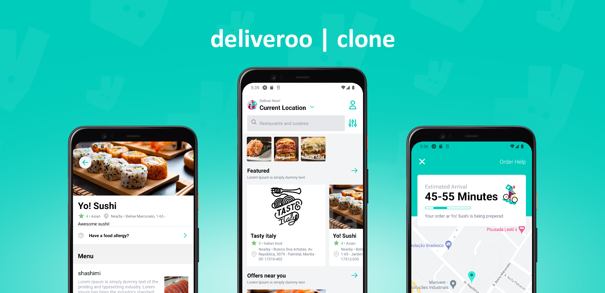

<div align="center">
  

</div>

## Sobre o Projeto
Atividade seguindo tutorial [Deliveroo 2.0 React-Native clone Sonny Sangha](https://www.youtube.com/watch?v=taPz40VmyzQ). A aplicação é um exercício com [React Native](https://reactnative.dev/) e [tailwindcss](https://tailwindcss.com/) onde conseguimos através de gerência de estado com [Redux Toolkit](https://redux-toolkit.js.org/), compartilhar informação com toda aplicação, sendo uma tela de categoria e restaurantes cadastrados, tela com os pratos do restaurantes, carrinho e tela com informações do delivery como localização e tempo de entrega. A alimentação de informações como restaurantes, pratos e endereços foi realizada com [Sanity](https://www.sanity.io/)

### 🛠 Tecnologias
As seguintes ferramentas foram usadas na construção do projeto:

- <a href="https://reactnative.dev/" > React Native</a>
- <a href="https://www.sanity.io/" > Sanity io</a>
- <a href="https://tailwindcss.com/"> Tailwindcss </a>
- <a href="https://redux-toolkit.js.org//"> Redux Toolkit </a>

### 🎲 Rodando o projeto

```bash
# Instale as dependências
$ yarn install
# ou
$ npm install

# Execute a aplicação
$ yarn dev
# ou
$ npm run dev
```